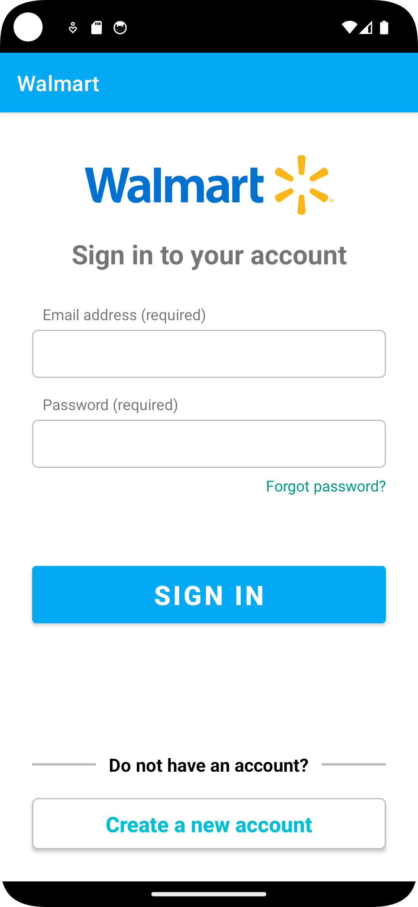
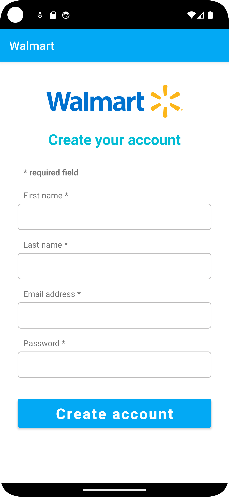
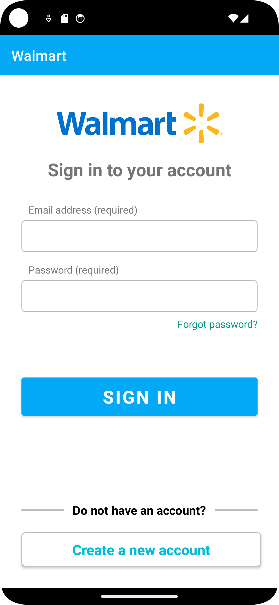
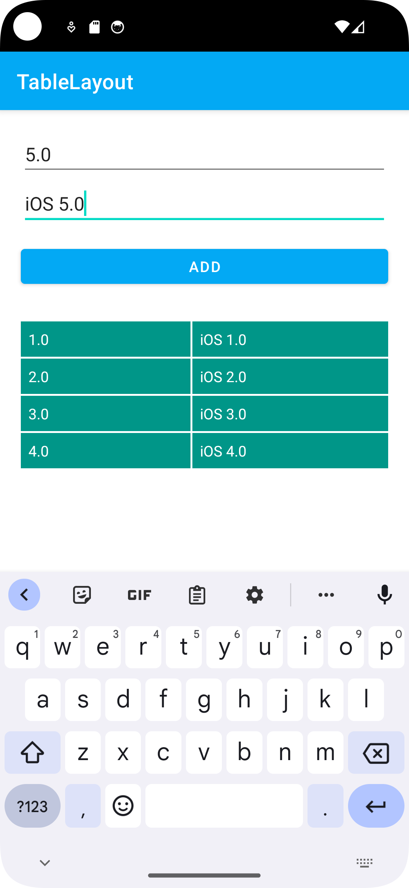
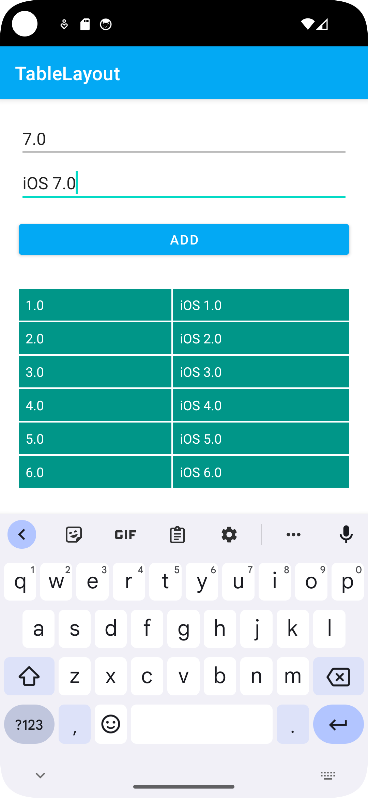
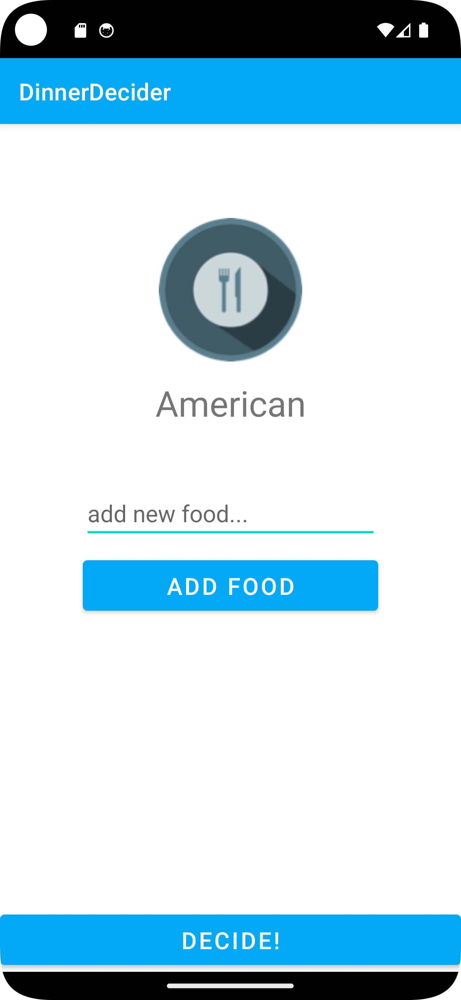

# Mobile Device Programing

# Screenshots

<h2>Assignment 4</h2>

Screenshot1             |  Screenshot2   |  Screenshot3
:-------------------------:|:-------------------------:|:-------------------------:
 |  | 

<h2>Assignment 3</h2>

<h3>Walmart</h3>

Screenshot1             |
:-------------------------:

<h3>TableLayout</h3>

Screenshot1             |  Screenshot2   |  Screenshot3
:-------------------------:|:-------------------------:|:-------------------------:
 |  | 

<h2>Assignment 2</h2>

Screenshot1             |  Screenshot2   |  Screenshot3
:-------------------------:|:-------------------------:|:-------------------------:
 |  | 

